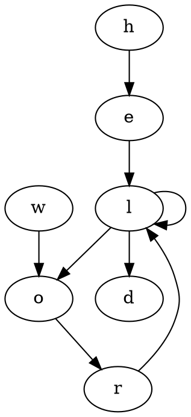
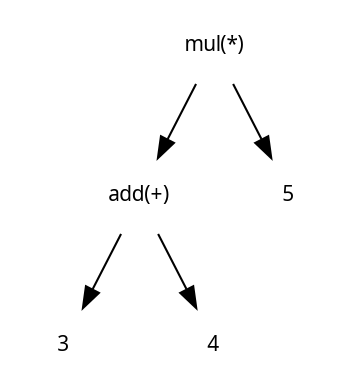
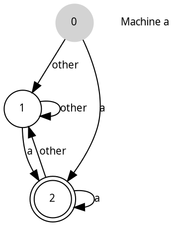
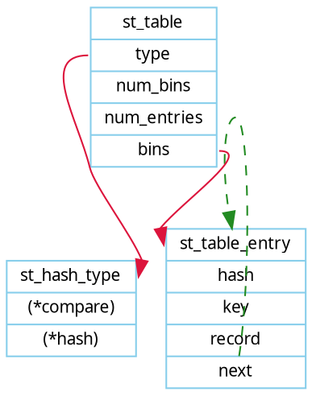
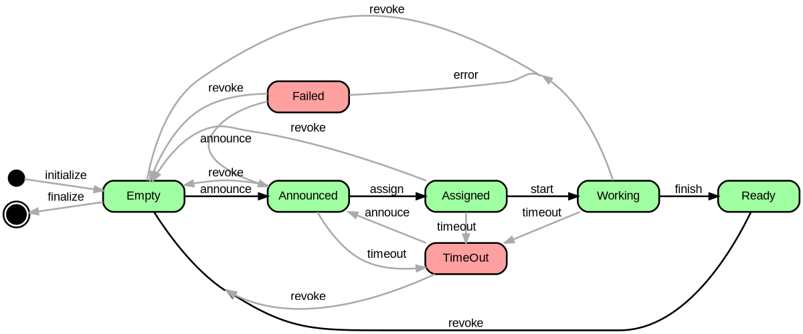

###初识

####初次见面
[graphviz](http://www.graphviz.org/)是一个非常棒的画图工具集，由AT&T实验室出品，码农装逼一大利器。

####小试牛刀
如学习新语言一样，我们从*hello world*开始。



我们用*graphviz*工具集中的dot转换成图片：

	dot -Tpdf *.dot > *.pdf

效果如下：


效果不错，但似乎有点单调，我们下面来剖析下。

###剖析

####graph
首先，graph可以设置许多特性，比如*label*，*rankdir*，*splines*等。具体说明参见：

* label="My Graph"; Label a graph itself

* rankdir=LR; Lay the graph out from Left to Right, instead of Top to Bottom

* {rank=same; a, b, c} Group nodes together at the same level of a graph

* splines="line"; Force edges to be straight, no curves or angles

* K=0.6; Used to influence the 'spring' used in the layout, Can be used to push nodes further apart, which is especially useful for twopi and sfdp layouts

####顶点
我们再来改变下顶点的特点，比如将顶点从原先的圆形修改成鸡蛋型。我们加入对顶点设置:

```dot
node [shape="egg", style="filled"]
```

效果如下：


当然，顶点还有很多特性可以设置，除了shape外，还有*label*，*fillcolor*，*style*等。 

####边
我们对边也可以进行某些特性的设置，如果*label*，*color*，*penwidth*等。

我们简单设置下:

```dot
edge [color="blue", style="dashed"]
```

效果如下:


####子图
graphviz另外还支持子图的绘制。比如：

```dot
subgraph cluster_world {
  label="world"
  bgcolor="gray"
  ...
}
```

效果如下:


###玩转
下面我们直接来看一下不同的效果图。

####抽像树




####状态机




####hash表


  


####流程图


([来自stackoverflow](http://stackoverflow.com/questions/11588667/how-to-influence-layout-of-graph-items))


